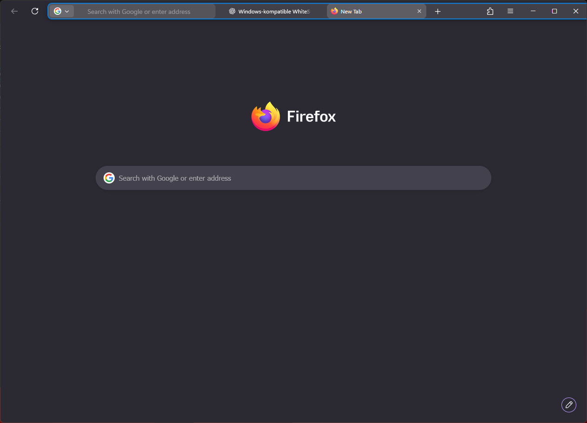

# WhiteSur Monterey Adaptive for Windows

A **Monterey-style, adaptive Firefox UI theme for Windows 11**.

It combines a compact Safari-inspired single-row toolbar with native Windows window controls, responsive tab handling, a PowerShell installer, safe profile detection, backups, and clean uninstall support.



> [!IMPORTANT]
> This is an unofficial community project. It is not affiliated with or endorsed by Mozilla, Apple, Vince Liuice, Rafael Mardojai, AdamXweb, or the developers of Adaptive Tab Bar Color.

## Features

- Monterey-inspired Firefox appearance on Windows
- Native Windows minimise, maximise, and close buttons on the right
- Single-row address bar and tabs on normal desktop widths
- Responsive compact mode that hides tabs before they overlap
- Stable spacing when navigation and page-action icons appear
- Clean tab closing without invisible gaps
- Draggable empty toolbar regions in restored windows
- Adaptive colours through Firefox theme variables
- Automatic Firefox profile detection
- Existing `chrome` folder backup and restoration
- Preserves your `customChrome.css` during updates
- No administrator rights required

## Adaptive colours

The theme is designed to work with **Adaptive Tab Bar Color**:

https://addons.mozilla.org/firefox/addon/adaptive-tab-bar-colour/

The extension changes Firefox's theme colours to match the active website. This theme consumes Firefox's standard lightweight-theme variables, so the toolbar and tabs can follow those colours.

Without the extension, the theme still works, but the colours remain based on Firefox's current theme instead of adapting per website.

## Installation

1. Download or clone this repository.
2. Fully close Firefox. Make sure no `firefox.exe` process remains.
3. Run `Install.cmd`.
4. Start Firefox again.

The installer:

- finds the Firefox profile selected by Firefox's `installs.ini`;
- backs up an existing `chrome` directory;
- installs the theme;
- enables `toolkit.legacyUserProfileCustomizations.stylesheets` through a managed `user.js` block.

Use `Check-Installation.cmd` to verify the active profile and installed version.

## Updating

Close Firefox and run `Install.cmd` from the newer release. A user-created `customChrome.css` is preserved.

## Uninstalling

Close Firefox and run `Uninstall.cmd`. The installer removes its managed preference block and restores the previous `chrome` backup when available.

## Compatibility

This release was developed for current Firefox on Windows 11 and is packaged as version `2026.07.28-15`.

Firefox does not officially support third-party browser chrome CSS as a stable public API. A future Firefox update can rename UI elements or change layout behaviour. Please report theme-specific breakage here rather than to Mozilla.

## Development and testing

This project was **heavily vibe-coded with ChatGPT**, then iteratively tested and corrected in real Firefox sessions on Windows. The final layout was shaped by repeated visual testing, especially around URL-bar geometry, tab closing, responsive widths, toolbar spacing, and native window dragging.

The repository also contains automated checks and local rendered fixtures. To run the complete suite:

```powershell
py -m pip install -r requirements-dev.txt
py -m playwright install chromium
py tests/render_layout.py
py tests/test_navigation_states.py
py tests/test_urlbar_geometry.py
py test_package.py
```

On Linux, set `CHROMIUM_EXECUTABLE` to a system Chromium path when you prefer not to use Playwright's bundled browser.

## Upstream and inspiration

This project is **heavily based on and inspired by**:

- [WhiteSur Firefox Theme](https://github.com/vinceliuice/WhiteSur-firefox-theme) by Vince Liuice — the main visual and CSS base
- [Firefox GNOME Theme](https://github.com/rafaelmardojai/firefox-gnome-theme) by Rafael Mardojai and contributors — layout and Firefox chrome implementation ideas
- [WhiteSurFirefoxThemeMacOS](https://github.com/AdamXweb/WhiteSurFirefoxThemeMacOS) by AdamXweb — Windows/macOS WhiteSur adaptation ideas

The Windows geometry, installer, responsive behaviour, regression tests, URL-bar containment fixes, tab-close handling, and packaging in this repository were adapted specifically for this project.

See [`THIRD_PARTY_NOTICES.md`](THIRD_PARTY_NOTICES.md) and the files in [`licenses/`](licenses/) for attribution and upstream licence texts.

## Licence

The Windows adaptation, installer, tests, documentation, and modifications in this repository are licensed under the **GNU Affero General Public License v3.0 or later** (`AGPL-3.0-or-later`). See [`LICENSE`](LICENSE).

Portions derived from upstream projects retain their original copyright and licence notices. In particular, the main WhiteSur Firefox source is MIT-licensed. The required notices are preserved in `licenses/` and `THIRD_PARTY_NOTICES.md`.

The AGPL choice applies to this combined adapted distribution and to original contributions in this repository. It does not remove the upstream authors' ability to distribute their original code under their original licences.

## Trademark note

Firefox and the Firefox logo are trademarks of the Mozilla Foundation. macOS, Monterey, and Safari are trademarks of Apple Inc. WhiteSur is used descriptively to identify the upstream visual project and style inspiration.
